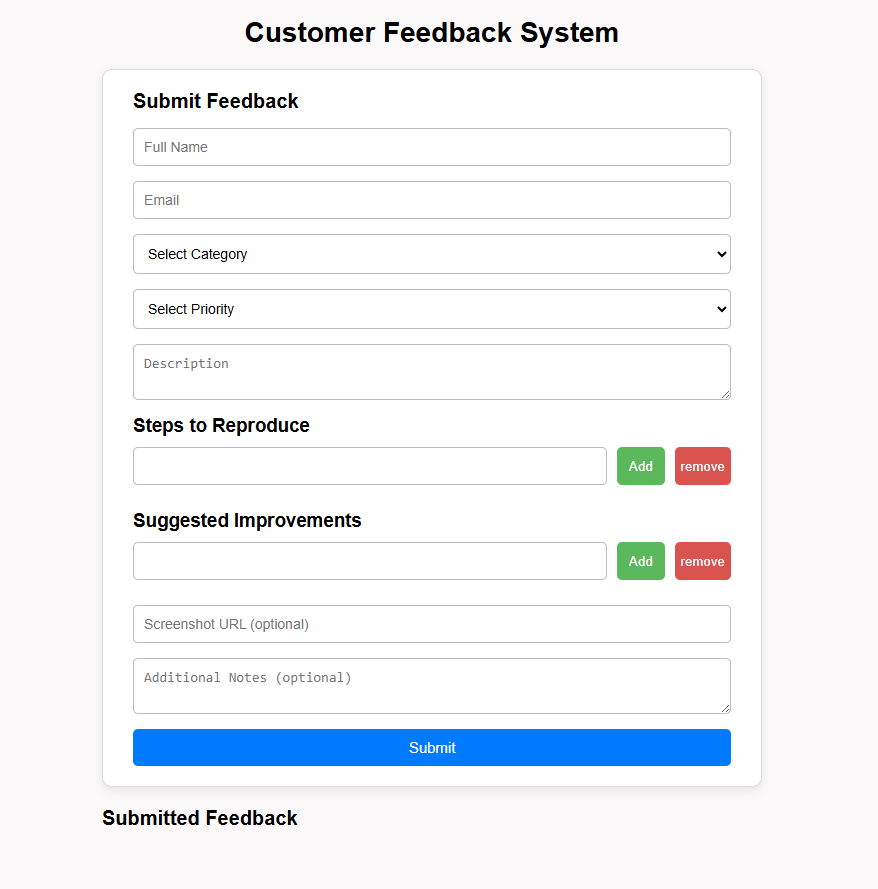

# 📌 Customer Feedback System

A React-based application for submitting, managing, and displaying customer feedback.
Users can report bugs, suggestions, complaints, and improvements with detailed information.

This project demonstrates real-world form handling, including controlled inputs, uncontrolled inputs, dynamic fields, validation, and a styled feedback dashboard.

---

## 🚀 Features

### 📝 Feedback Form
- Full Name  
- Email  
- Category (Bug / Suggestion / Complaint / Other)  
- Priority (Low / Medium / High)  
- Description  
- Screenshot URL (optional – uncontrolled input)  
- Additional Notes (optional – uncontrolled textarea)

---

### ➕ Dynamic Fields
Users can add/remove rows for:
- Steps to Reproduce
- Suggested Improvements

---

### 🎛 Controlled vs Uncontrolled Components

**Controlled**
- Name, Email, Category, Priority, Description  
- Steps List, Suggestions List  

**Uncontrolled (via useRef)**
- Screenshot URL  
- Additional Notes  

---

### ⚙️ Validation
- Required fields  
- Email format check  
- Minimum description length  
- Disabled submit until valid  

---

### 🎨 UI & Styling
- Clean card-based layout  
- Simple CSS (no Tailwind)  
- Input focus highlights  
- Error borders  
- Responsive grid for feedback cards  

---

## 📋 Feedback Dashboard

Displays each submission with:
- Category + Priority badges  
- Description  
- Screenshot preview (if available)  
- Steps list  
- Suggestions list  
- Timestamp  

---

## 📂 Project Structure

```
src/
│
├── App.jsx
├── App.css
│
├── Component/
│ ├── FeedbackForm.jsx
│ ├── FeedbackList.jsx
│ ├── FeedbackCard.jsx
│ └── DynamicList.jsx
│
└── index.js
```


## Installation & Setup

### 1️⃣ Clone the repository
```
git clone <your-repository-url>
```


### 2️⃣ Navigate into the project folder
```
cd customer-feedback-system
```


### 3️⃣ Install dependencies
```
npm install
```


### 4️⃣ Start the development server
```
npm run dev
```


The app will open at:
http://localhost:5173/

## 🔍 How It Works

1. User fills the form  
   All key details are collected and validated.

2. Dynamic fields  
   Users can add multiple steps & suggestions.

3. Submit feedback  
   Data is passed through props and added into the feedback state.

4. Display submissions  
   Feedback shows up instantly in the feedback list as styled cards.

## 🧪 Technologies Used

- React.js
- JavaScript
- React Hooks (useState, useRef)
- Simple CSS (no frameworks)

## 📸 Screenshots



## 🎯 Future Enhancements

- LocalStorage support
- Edit/Delete feedback
- Filter feedback by priority/category
- Backend API support
- Dark mode UI

## 👩‍💻 Author

Mitali Patel
