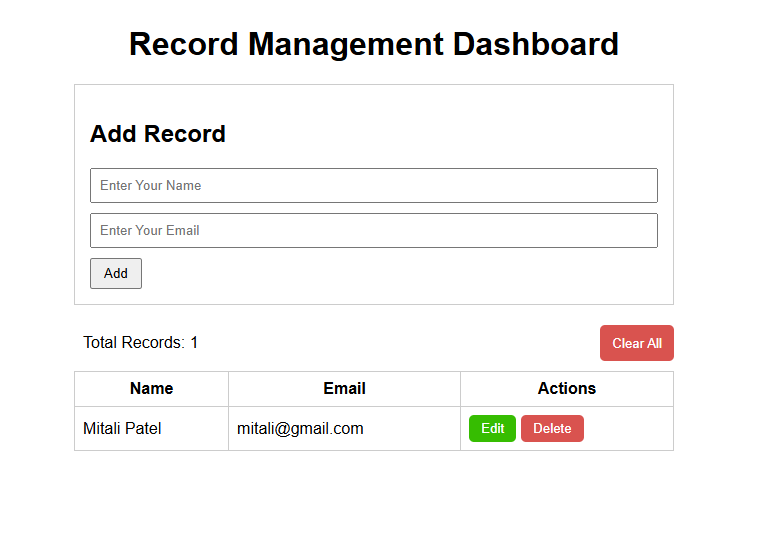

# 📘 Record Management System (React)

A simple **Record Management System** built using **React and plain CSS**.  
This project demonstrates core React concepts such as component-based architecture, state management, event handling, conditional rendering, and browser `localStorage` integration.

This project is suitable for **college assignments, practical exams, and viva**.

---

## 🚀 Features

- Add new records
- Edit existing records
- Delete individual records
- Clear all records
- Form validation (required fields)
- Persistent data storage using **localStorage**
- Real-time UI updates
- Simple UI using **plain CSS** (No Bootstrap / Tailwind)

---

## 📸 Screenshots



## 🧱 Project Structure
```
src/
├── App.jsx
├── App.css
├── index.css
├── main.jsx
└── components/
    ├── RecordForm.jsx
    ├── RecordList.jsx
    └── RecordRow.jsx
```
---

## 🧩 Component Description

### 🔹 App.jsx
- Main component of the application
- Manages records using state
- Handles add, edit, delete, and clear operations
- Syncs data with `localStorage`

---

### 🔹 RecordForm.jsx
- Handles adding and editing records
- Uses controlled form inputs
- Performs basic validation
- Switches between **Add Mode** and **Edit Mode**

---

### 🔹 RecordList.jsx
- Displays records in a table
- Shows **“No Records Found”** when empty
- Passes record data to `RecordRow`

---

### 🔹 RecordRow.jsx
- Displays a single record
- Contains **Edit** and **Delete** buttons
- Demonstrates passing arguments to event handlers

---

## 🎯 React Concepts Used

- Functional Components
- `useState` Hook
- `useEffect` Hook
- Controlled Forms
- Event Handling (`onChange`, `onSubmit`, `onClick`)
- Props and argument passing
- Conditional Rendering
- Browser `localStorage`

---

## 💾 Local Storage Workflow

- Records are loaded from `localStorage` on app load
- Any add, edit, or delete updates `localStorage`
- Data persists even after refreshing the page

---

## ▶️ How to Run the Project

1. Create a React app (Vite recommended):
```bash
npm create vite@latest record-management
cd record-management
npm install
npm run dev
```