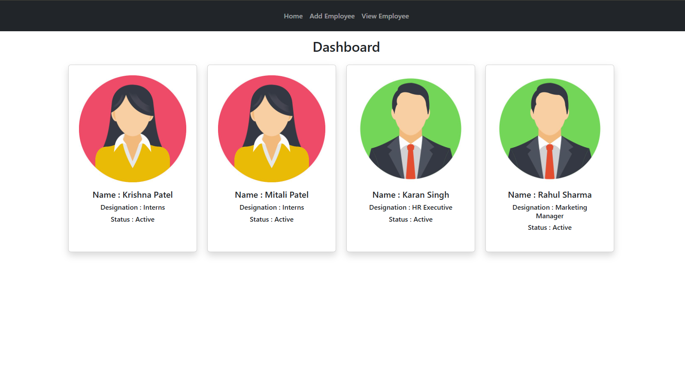
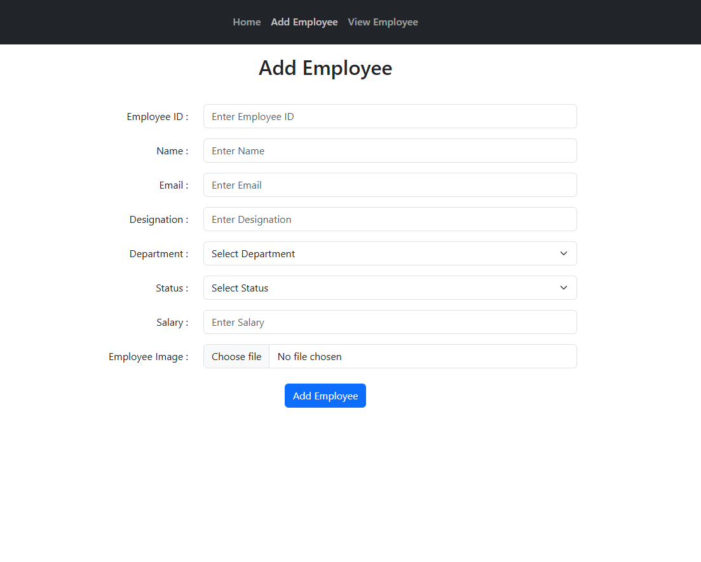
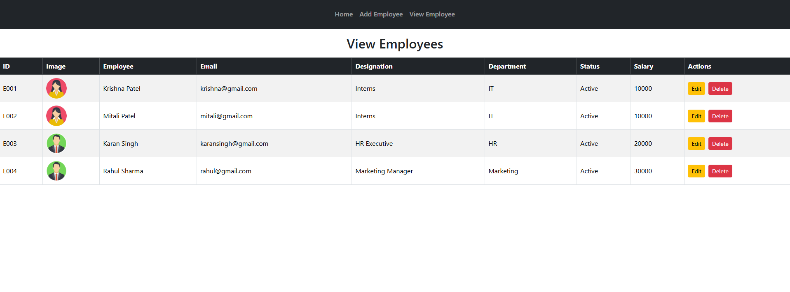
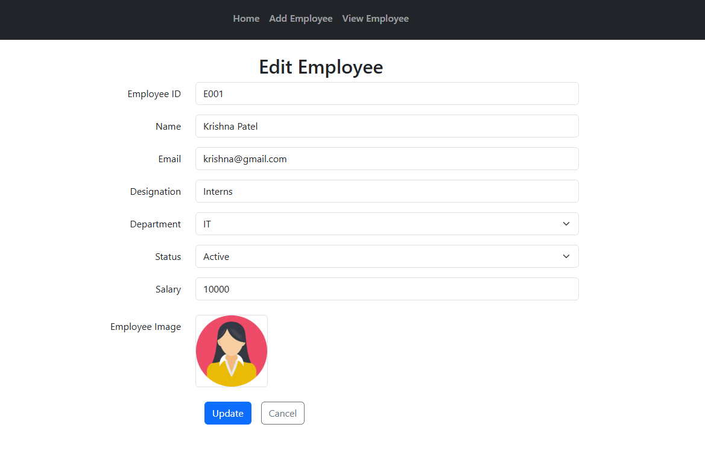

# 📌 Employee Management System

A **React.js** application for managing employees with basic CRUD (Create, Read, Update, Delete) functionality. This app uses **localStorage** to persist data and **React Router** for navigation. It also incorporates **Bootstrap 5** for styling.

---

## 🚀 Features

- **Dashboard (Home)**: Displays all employees in a card layout with key details like name, designation, and status.
- **Add Employee**: Form to add a new employee with fields for ID, name, email, designation, department, status, salary, and image upload.
- **View Employees**: Table view of all employees with options to edit or delete.
- **Edit Employee**: Update employee details (excluding ID and name) and view the employee image.
- **LocalStorage Persistence**: All employee data is stored locally in the browser.
- **Responsive UI**: Mobile-friendly layout using Bootstrap cards and tables.

---

## 📸 Screenshots

### Dashboard


### Add Employee


### View Employees


### Edit Employee


---

## 🛠️ Technologies Used

- React.js
- React Router DOM
- Bootstrap 5
- LocalStorage API

---

## ⚙️ Installation & Setup

### 1️⃣ Clone the repository
```
git clone <your-repository-url>
```


### 2️⃣ Navigate into the project folder
```
cd employee-management
```

### 3️⃣ Install dependencies
```
npm install
```


### 4️⃣ Start the development server
```
npm run dev
```

The app will open at:
http://localhost:5173/

---

## 📂 Project Structure

```
src/
│
├─ components/
│   └─ Navbar.jsx
│
├─ pages/
│   ├─ Home.jsx
│   ├─ AddEmployee.jsx
│   ├─ ViewEmployee.jsx
│   └─ EditEmployee.jsx
│
├─ App.jsx
├─ App.css
└─ index.jsx
```

---

## 🚀 Usage

- Navigate to **Add Employee** to add new employees.
- Go to **View Employees** to see the list of all employees.
- Edit or delete employees using the respective buttons in the **View Employees** table.
- The **Dashboard** shows a quick overview of all employees with their images, designation, and status.

---

## 📝 Notes

- **Employee ID** and **Name** are immutable after creation.
- Employee images are stored as **Base64 strings** in `localStorage`.
- Data persists only in the browser and will be lost if **localStorage is cleared**.

---

## 🔮 Future Enhancements

- 🔍 Search and filter employees
- 📤 Export employee data to CSV
- 🔐 Authentication and role-based access
- ☁️ Backend integration with database

