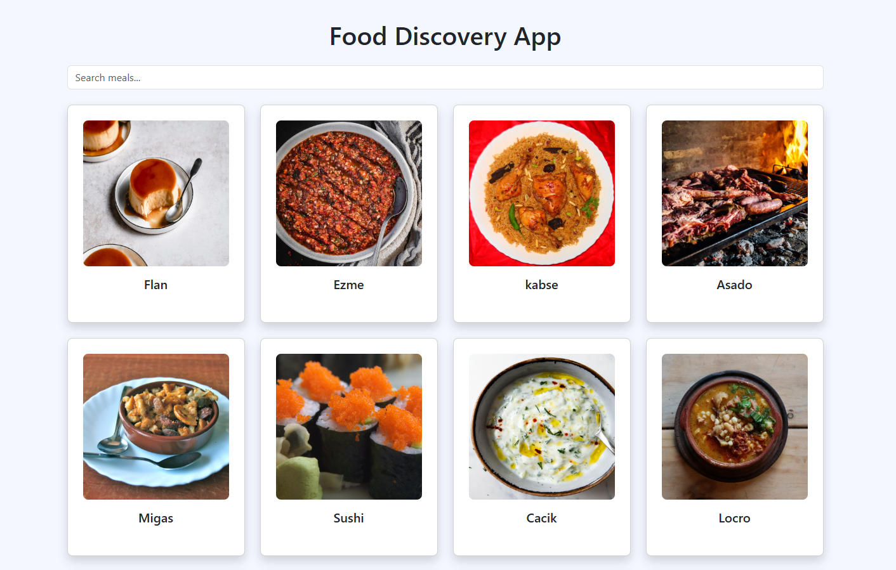
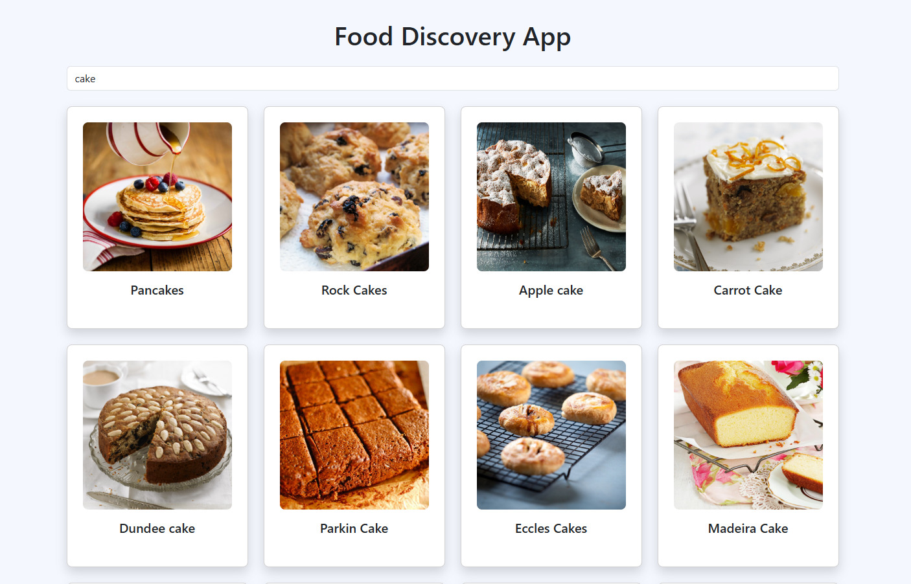

# 🍽️ Food Discovery App

Food Discovery App is a React.js application that allows users to explore meals from around the world using the TheMealDB API. Users can view all meals on the homepage and search for specific dishes using a responsive and dynamic search feature.

This project demonstrates API integration, React Hooks, Context API, environment variables, and responsive UI design using Bootstrap.

---

## 🚀 Features

* 🔍 Search meals by name
* 🌎 Browse meals from TheMealDB API
* ⚡ Fast and responsive user interface
* 🔄 Dynamic API data fetching
* 🧠 Global state management using Context API
* ⏳ Loading state handling
* ❌ Error handling for failed API calls
* 🔐 Secure API URL using .env file
* 📱 Fully responsive design (Desktop, Tablet, Mobile)

---

## 🛠️ Tech Stack

* React.js (Vite)
* JavaScript (ES6+)
* Bootstrap 5
* Context API
* TheMealDB API
* HTML5
* CSS3

---

## 📁 Project Structure

```
api-hunter/

├── public/

├── screenshots/
│   ├── homepage.png
│   └── search.png

├── src/
│   ├── components/
│   │   ├── Search.jsx
│   │   ├── Card.jsx
│   │   └── Loader.jsx
│   │
│   ├── pages/
│   │   └── Home.jsx
│   │
│   ├── App.jsx
│   ├── main.jsx
│   └── index.css

├── .env
├── package.json
└── README.md
```

---

## ⚙️ Environment Variables

Create a `.env` file in the root folder and add:

```
VITE_API_URL=https://www.themealdb.com/api/json/v1/1
```

Restart the server after creating the .env file.

---

## 📦 Installation and Setup

Step 1: Clone the repository

```
git clone https://github.com/your-username/api-hunter.git
```

Step 2: Open project folder

```
cd api-hunter
```

Step 3: Install dependencies

```
npm install
```

Step 4: Run the project

```
npm run dev
```

---

## 🌐 API Used

The project uses TheMealDB public API.

Base URL:

```
https://www.themealdb.com/api/json/v1/1
```

Search endpoint:

```
/search.php?s=
```

---

## 📷 Screenshots

### Homepage



### Search Functionality



---

## 🧠 Concepts Used

* React Functional Components
* React Hooks (useState, useEffect, useContext)
* Context API
* API Integration using fetch()
* Conditional Rendering
* Environment Variables
* Component-based architecture

---

## 📱 Responsive Design

The application works on:

* Desktop
* Tablet
* Mobile

---

## 👨‍💻 Author

Mitali Patel

---

## 📄 License

This project is open source and available for educational purposes.
