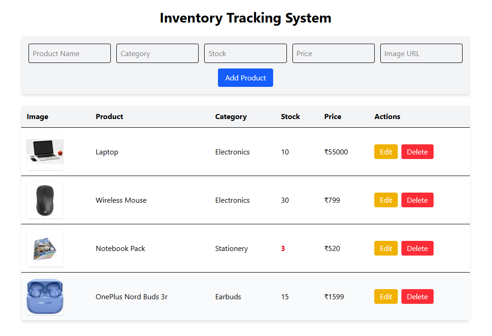

# 📦 Inventory Tracking System

A modern **Inventory Tracking System** built using React, Redux Toolkit, and Firebase Realtime Database.
This web application allows businesses to **manage their product inventory in real-time** with full CRUD operations.

---

## 📖 Project Overview

The Inventory Tracking System helps **store owners or warehouse managers** manage product inventory efficiently.
Users can **add products, update product information, delete products, and monitor stock levels**.

All data is stored in **Firebase Realtime Database**, ensuring that updates are reflected instantly in the application.

---

## ✨ Features

- ✔️ Add new products to inventory  
- ✔️ View all products in a structured table  
- ✔️ Edit product details  
- ✔️ Delete products  
- ✔️ Low stock alert (products with stock below 5 are highlighted)  
- ✔️ Real-time database synchronization  
- ✔️ Responsive UI with clean design  
- ✔️ Product image support

---

## ⚙️ How It Works

1️⃣ **Add Product**
Users enter product details such as **name, category, stock quantity, price, and image URL** in the form.
When the **Add Product** button is clicked, Redux dispatches an action that sends the product data to **Firebase Realtime Database**.

2️⃣ **Fetch Products**
When the application loads, it automatically fetches all products from Firebase using **Redux async thunk** and displays them in a table.

3️⃣ **Edit Product**
Clicking the **Edit** button loads the product data into the form.
After updating the details, clicking **Update Product** saves the changes to Firebase.

4️⃣ **Delete Product**
Clicking the **Delete** button removes the selected product from the Firebase database.

5️⃣ **Low Stock Alert**
If the product stock is **less than 5**, the stock value is highlighted in **red** to notify users about low inventory.

6️⃣ **Real-Time Sync**
Whenever a product is added, updated, or deleted, the application **re-fetches the data from Firebase**, ensuring the UI always shows the latest inventory.

---

## 🛠 Tech Stack

### Frontend

* React.js ⚛️
* Redux Toolkit 🔄
* Tailwind CSS 🎨

### Backend / Database

* Firebase Realtime Database 🔥

### State Management

* Redux Toolkit with Async Thunks

---

## ⚙️ Installation

### 1️⃣ Clone the repository

```bash
git clone https://github.com/your-username/inventory-tracking-system.git
```

### 2️⃣ Navigate into project

```bash
cd inventory-tracking-system
```

### 3️⃣ Install dependencies

```bash
npm install
```

### 4️⃣ Start the development server

```bash
npm run dev
```

---

## 🔥 Firebase Setup

1️⃣ Go to Firebase Console
2️⃣ Create a new project
3️⃣ Enable **Realtime Database**
4️⃣ Replace your Firebase configuration inside:

```
src/firebase/firebaseConfig.js
```

Example configuration:

```javascript
const firebaseConfig = {
  apiKey: "YOUR_KEY",
  authDomain: "YOUR_PROJECT.firebaseapp.com",
  databaseURL: "https://YOUR_PROJECT-default-rtdb.firebaseio.com/",
  projectId: "YOUR_PROJECT",
  storageBucket: "YOUR_PROJECT.appspot.com",
  messagingSenderId: "XXXX",
  appId: "XXXX"
}
```

---

## 📂 Folder Structure

```
src
│
├── app
│   └── store.js
│
├── components
│   ├── AddProduct.jsx
│   ├── ProductList.jsx
│   └── EditProduct.jsx
│
├── features
│   └── product
│       └── productSlice.js
│
├── firebase
│   └── firebaseConfig.js
│
├── App.jsx
├── main.jsx
└── index.css
```

---

## 📸 Application Screenshot



---

## 🚀 Future Improvements

* 🔍 Product search functionality
* 📂 Category filtering
* 📊 Dashboard statistics
* 🔐 Authentication system
* 🖼 Product image upload using Firebase Storage

---

## 👩‍💻 Author

**Mitali Patel**